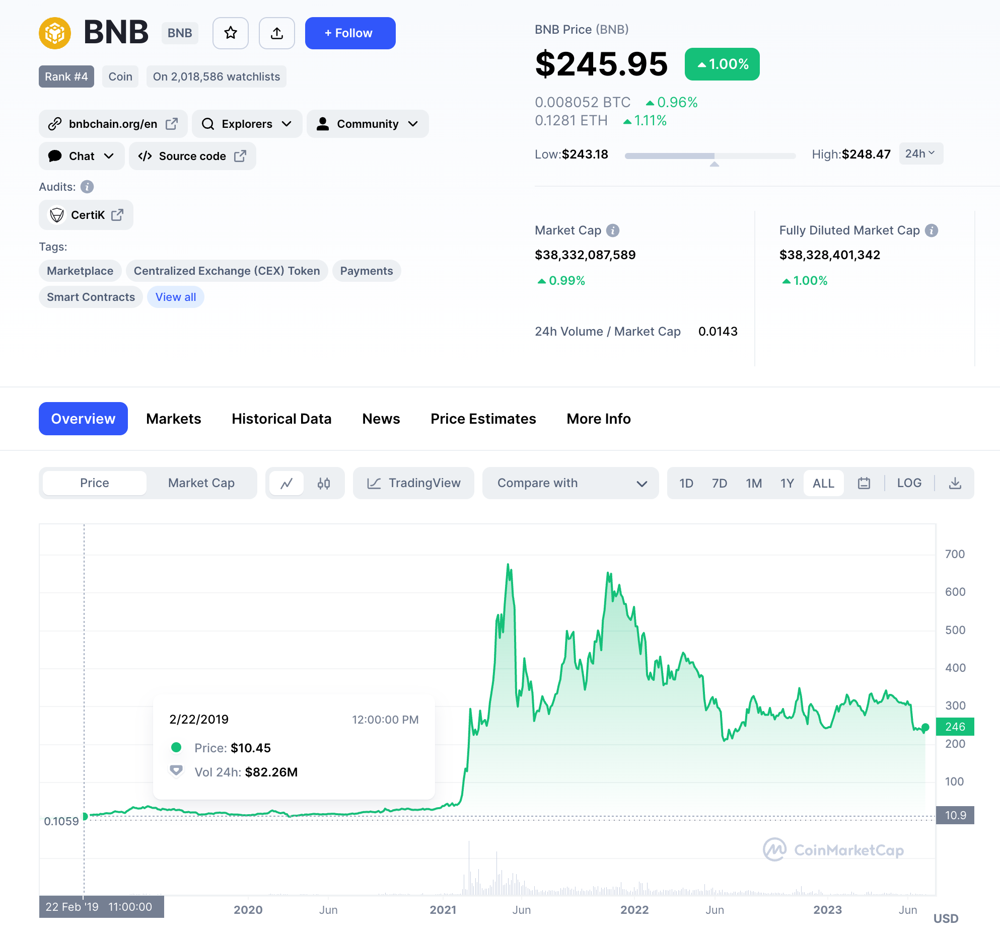
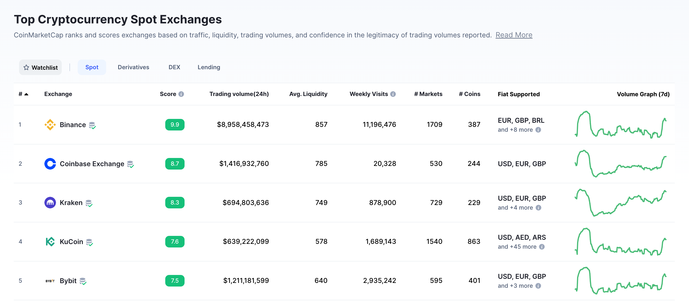
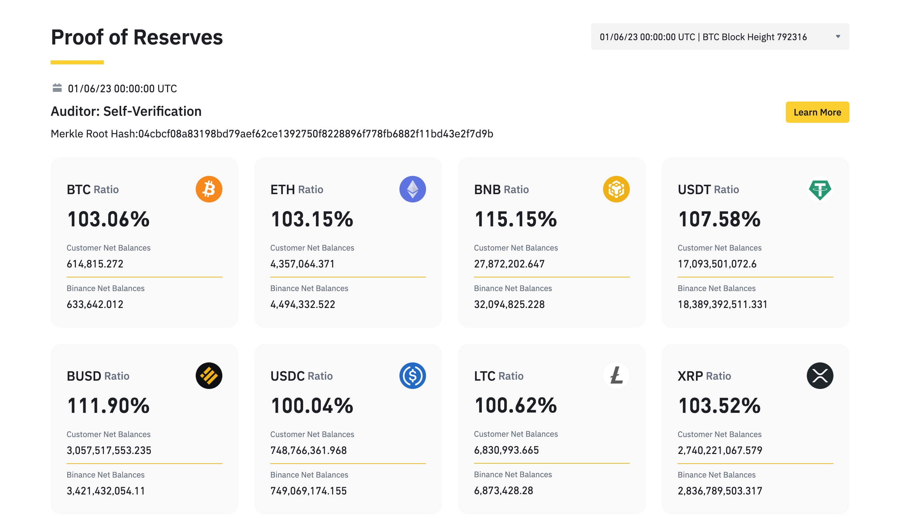

# Binance - Crypro giant's being and becoming

## Overview and Origin

Changpeng Zhao, a developer who previously designed high-frequency trading software, started Binance in 2017. Before creating Binance, CZ worked at OKCoin, which is also a top crypto exchange. And it was from Okex, CZ met He Yi, co-founder of Binance and the most important female in his life. He Yi is the person who encouraged CZ to invest in the crypto field in the early stages, and also, his wife.

Back in 2017, ICO was the theme of the whole bull run. Binance was also successfully launched through a 15 million ICO, and $BNB was issued at around $0.15 during ICO. $BNB is still one of the most rewarded tokens with more than 200x returns within 4 years, relying on Binance's crazily high-profit business model.

In 2018, Sequoia Capital, a venture capital firm, sued Binancefor allegedly breaching an exclusivity agreement. When Binance launched in August 2017, Zhao was negotiating terms with Sequoia Capital regarding an investment. Sequoia invested slightly more than $8 million in Binance for an 11% interest in talks that valued the cryptocurrency at $80 million at the time. Zhao's team advised Sequoia that Binance's shareholders considered the suggested $80 million to be an undervaluation. As the deal failed to materialize, Zhao of Binance received a separate offer from another venture capital firm, IDG Capital. The terms of the much higher valuation included two planned rounds of fundraising of $400 million and $1 billion, respectively.

Through the growth of Binance, it has never been absent from headlines.

## Business Activities
CZ was in charge of transforming Binance into a decentralised business with a quick-thinking global team. Additionally, he was a driving force behind Binance's growth into an exchange that provides users with clear benefits, huge volumes, and low costs.

The Binance product quickly established itself as being too compelling for the crypto community to be held back by persistent difficulties. After only six months of operation, Binance shot to the top of the list of cryptocurrency exchanges, where it has remained to this day.

- Binance’s number of users was 89.5 million in August 2023.
- The number of Binance active users was around 877,682 addresses per day in late August 2023.
- The Binance.us number of users was 2.5 million in August 2023.
- BUSD exceeded $17 billion in market capitalisation during the first half of 2023. (BUSD is the stablecoin issued by Paxos but listed on Binance)
- Binance’s revenue amounted to around $20 billion in 2021.
- Binance Labs has set aside $500 million for Web3 and Blockchain projects.
- Binance trading volume is around 9 billion per day, with 387 coins listed.
- Binance has 633K BTC in its reserve, leading in BTC reserve ranking

  

### But why Binance can be the largest crypto exchange?

My understanding of this question can be summarised in the following bullet points.

- **First-mover advantage**
  
Finance joined the CEX fields in the very early days. There were some CEXs such as Bitfinex. But I mean Binance is probably the first one to create a mobile trading app with a smooth user experience.

- **Customer focused**
  
Co-founder Heyi is the lead of the customer service team, they have great care for each level of client. Focusing on the VVVIP clients, they sent gifts with Finance logo. A lot of those VVVIP users are also influencers with a lot of followers on Twitter. When they post their gift from Binance, it's kind of a show-off from those crypto OG and also a big promotion on the Binance brand.

- **IEO in 2018**
  
2018 is a long and painful bear market for a lot of crypto enthusiasts. A lot of crypto projects and centralised exchanges were liquidated in that year. However, Finance started IEO (Initial Exchange Offering), which becomes the highlight in that gloomy year. Binance users can use $BNB to participate in the project in the very early stage, at almost the same cost as huge venture capital, but even better, with no lock-up period. A lot of projects had at least 10X return when listed. The IEO platform captures the value to $BNB, which allows it to hold a solid piece in the bear market and thrive in the bull run, and so does Binance.

- **Catch the craze**
  
Binance not only leads the trend but also reacts to the trends and hot themes in the market very quickly. When Defi is getting popular in 2019, Binance started Binance smart chain, with BRC20 tokens. BSC empowers its users to build their decentralised apps and digital assets, just like a copycat of Ethereum, but faster. It is EVM Compatible, using POS, with only 3s block time. When talking about the defi summer in 2020, apart from the famous defi apps on Ethereum, a lot of BSC Defi apps also play an important role in that summer. Crypto narratives keep evolving from Defi to Gamefi, NFT, and Binance have never been absent from them.

## Landscape

CEX has been criticised as being too centralised, which departs from the spirit of blockchain -- decentralisation. The criticism of CEX usually focuses on price manipulation, the black box of clients' funds custody.

In the 2017 bull run, Bitfinex, Okcoin, Huobi, Poloniex etc.
But in the 2020 - 2022 bull run, Binance, FTX, Coinbase, Karenken, Crypto.com, Okex, Bybit led the market. 

A lot of changes could happen in the crypto world within just 5 years, the top CEX ranks also never stop changing. But Binance has been quite stable in its #1 place for at least 3 years.

Its biggest competitor, FTX, was started by Sam Bankman-Fried (SBF) in May 2019. FTX is an abbreviation of "Futures Exchange". Changpeng Zhao of Binance purchased a 20% stake in FTX for approximately $100 million, six months after Bankman-Fried and Wang started the firm. FTX has a very good design on its derivative products, which was favoured by futures traders, which Binance can't beat. And FTX also has the most regulated CEX brand image at that time. At its peak in July 2021, FTX had over one million users and was the third-largest cryptocurrency exchange by volume.

However, what happened in late 2022 surprised all the crypto traders. FTX collapsed with 3.1 billion debt to large creditors and 5 billion to 9 million customers within a month. The trigger of this tragedy is Binance sell-off of $FTT (tokens issued by FTX), and CZ's twit which cause the panic and bank run. But what really destroyed FTX crypto empire is its bad compliance, terrible internal control, chaotic management and risk appetite. The bankruptcy of FTX raises people's concern about how CEX segregate clients' funds, and highlights the importance of decentralisation, the reason why people need BTC and blockchain - "not your key, not your money"

## Results

After the calamity of FTX collapse, Binance was criticised as being the trigger of many people's loss. And killing its biggest enemy causes Binance at risk of violating antitrust laws. 

Crypto traders lost trust in CEX and focus on DEX (Decentralised Exchange) more. It was at this urgent time, Binance started its Proof of Reserve, which publishes its reserve address and tracks the balance of all the tokens in its wallets. Proof of Address utilises the Merkle tree, a cryptographic tool that enables the consolidation of large amounts of data into a single hash, which gives users the ability to verify specific contents that were included within a particular set of “sealed” data. By using a zk-SNARK, a crypto exchange can prove that all Merkle tree leaf nodes’ balance sets (i.e., user account balances) contribute to the exchange’s claimed total user asset balance. Each user can easily access their leaf node as having been included in the process. After this Proof of Reserve approach, many CEX followed Binance to publish at least something to show how they safeguard clients' funds, which is a big progress to crack the CEX black box.

What's more, a lot of regulators who used to be open-minded about cryptos become more prudential in their license to crypto-related products. As the leader in the crypto Industry, Binance is also facing more and more strict supervision. On 5 June 202, SEC Files 13 Charges Against Binance Entities and Founder Changpeng Zhao. Charges include operating unregistered exchanges, broker-dealers, and clearing agencies; misrepresenting trading controls and oversight on the Binance.US platform; and the unregistered offer and sale of securities.

## Recommendations

As the giant in the crypto industry, Binance needs to contribute more to compliance, the establishment of relevant regulations, and education on people who have limited knowledge about crypto.
It also needs to be more responsible for the whole industry's growth and image. When it's necessary, maybe give up some market shares to competitors, which can help Binance have more allies when facing the regulators.

## References
[1][From Burgers to Bitcoin Billions: How CZ Built a Leading Crypto Exchange in Just 180 Days](https://www.binance.com/en/blog/from-cz/from-burgers-to-bitcoin-billions-how-cz-built-a-leading-crypto-exchange-in-just-180-days-421499824684901276)

[2][VC Giant Sequoia Sues Crypto Exchange Binance Over Failed Financing Deal](https://www.ccn.com/vc-giant-sequoia-sues-crypto-exchange-binance-over-failed-financing-deal/)

[3][Mind-Blowing Binance Statistics and Facts for 2023](https://www.banklesstimes.com/binance-statistics/)

[4][https://coinmarketcap.com/rankings/exchanges/](https://coinmarketcap.com/rankings/exchanges/)

[5][https://www.bnbchain.org/en/smartChain](https://www.bnbchain.org/en/smartChain)

[6][https://en.wikipedia.org/wiki/FTX](https://en.wikipedia.org/wiki/FTX)

[7][https://www.binance.com/en/proof-of-reserves](https://www.binance.com/en/proof-of-reserves)
